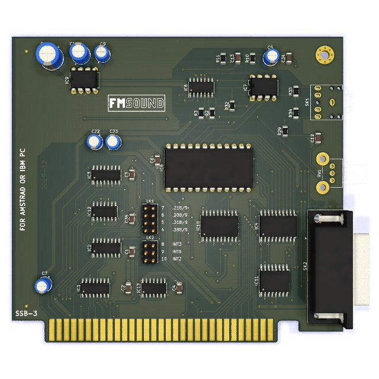

# YM3812 card with gameport

This 8-bit ISA card is essentially a clone of Amstrad's Adlib clone with gameport.

The routing and silk screen are a bit tidier and the DA15 connector has been shifted to make it easier to adapt off-the-shelf slot brackets.

## Front view

This picture shows the front of the card.

## Vintage components

Besides readily available standard components, the card uses four vintage components:

- Yamaha YM3812 (OPL2 FM synthesizer)
- Yamaha Y3014B (matching DAC for OPL2)
- TDA7233 (amplifier)
- NE558 (quad timer IC)

## License

The following license applies to the files in this repository:

This work is licensed under the Creative Commons Attribution-ShareAlike 4.0 International License. To view a copy of this license, visit http://creativecommons.org/licenses/by-sa/4.0/ or send a letter to Creative Commons, PO Box 1866, Mountain View, CA 94042, USA.
